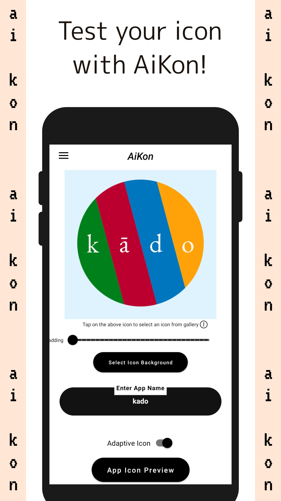

# AiKon

Test and preview your android app icons with AiKon. AiKon lets you make a home screen shortcut to help you in previewing your icon.

With AiKon you can also check how your icon looks in the notification bar and service.

The process of icon designing usually takes place on a desktop computer. On desktop it can be hard to recreate the perspective as well as the contrast of mobile phone. This is where AiKon steps in. Without the hassle of building an apk, you can easily test the designed icon.

With Notification icons, we face the same problems. Sometimes it is based on stroke size or just perspective difference. AiKon also generates notification previews for you application icons.

In fact, AiKon was made for testing icons of applications made by arupakaman studios. We find AiKon to be a really helpful tool for both UI/UX Designers as well as Application Developers.

-------------------------------------------------
AiKon – Features
-------------------------------------------------

- Preview your icons in the launcher
- Change the background color for icons
- Adjust icon padding
- Create as many home screen shortcuts as you want
- Preview Notification icons

AiKon is still in BETA. There exists a possibility that it might not work on your device.

AiKon is available on the Google Play Store.  

We hope this app serves you well.

AiKon is developed by Arupakaman Studios.
Arupakaman Studios is a group of independent developers working on various applications and services.

You can send us your feedback and app suggestions via email.

## Contact Us

Contact us at: arupakamanstudios[AT]gmail[DOT]com

## Licensing

AiKon is licensed under the [MIT License.](LICENSE)